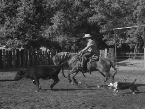
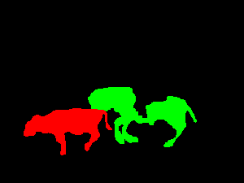

# Instance-Detection-Hoofed-Animals
Ce projet a été réalisé par [@Sirine Louati](https://github.com/sirinelouati) et [@Antoine Lelong](https://github.com/AntoineLlg) dans le cadre du Séminaire de modélisation statistique, cours proposé en 2ème année de l'ENSAE Paris.

Le but de ce projet est d'implémenter un modèle capable de repérer et identifier des animaux sur des images comme celle ci :  
Image brute             |  Masque (réponse cible)
:-------------------------:|:-------------------------:
  |    

Les données que nous utilisons sont libres d'utilisation, et peuvent être téléchargées [ici](https://web.engr.oregonstate.edu/~sinisa/HoofedAnimalsDataset.html).  
