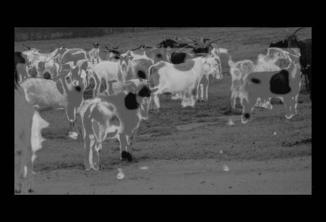

# Instance-Detection-Hoofed-Animals
Ce projet a été réalisé par [@Sirine Louati](https://github.com/sirinelouati) et [@Antoine Lelong](https://github.com/AntoineLlg) dans le cadre du Séminaire de modélisation statistique, cours proposé en 2ème année de l'ENSAE Paris.

Le but de ce projet est d'implémenter un modèle capable de repérer et identifier des animaux sur des images comme celle ci :  
Image brute             |  Masque (réponse cible)
:-------------------------:|:-------------------------:
  |    

Les données que nous utilisons sont libres d'utilisation, et peuvent être téléchargées [ici](https://web.engr.oregonstate.edu/~sinisa/HoofedAnimalsDataset.html).  

Le modèle que nous avons étudié est la combinaison de deux réseaux de neurones, un UNet et un RetinaNet. Nous avons implémenté et entrainé un UNet dans le but de détecter les emplacements des animaux sur une image. Un RetinaNet utiliserait ensuite ces sorties en plus de l'image d'origine afin d'identifier les animaux et leur emplacement.

Voici un exemple de sortie du UNet:

Input           |  Masque (réponse cible)
:-------------------------:|:-------------------------:
  |   
Output           |  Superposition de l'output et de l'input
:-------------------------:|:-------------------------:
  |    

L'architecture UNet utilise des couches de convolution et des maxpool, qui n'imposent pas une dimension d'entrée particulière sauf une divisibilité par 2 pour la couche maxpool. Nous avons ajusté les dimensions des images par padding afin d'uniformiser leur taille et s'assurer leur bon passage à travers le réseau de neurones.  
Pour des raisons de temps de calcul, l'entrainement s'est fait sur les plus petites images du dataset, mais le modèle se généralise sans souci à des images plus grandes.

Input           |  Masque (réponse cible)
:-------------------------:|:-------------------------:
  |   
Output           |  Superposition de l'output et de l'input
:-------------------------:|:-------------------------:
  |   
